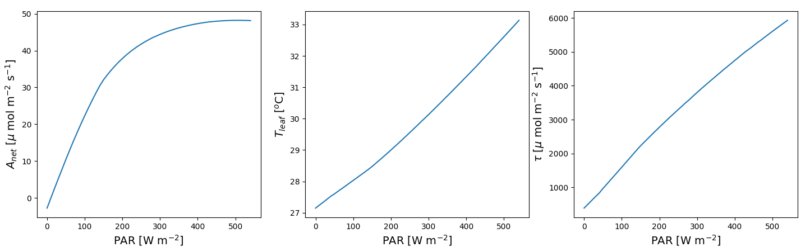

# **pyLeaf1.0**: *Class based python code to simulate the leaf scale fluxes based on the surrounding microenvironment*

## This code is an improvement to the Matlab code used in my publication [(Link)](https://doi.org/10.1111/pce.14821)

<span style="font-size: 20px; color: yellow;">Currently the pyLeaf only simulates the C4 leaf fluxes. Soon we will add C3 photosynthetic pathways also.</span>

> ## Requirements: python packages
>> **GEKKO** (optimizer) \
>> **pandas** (input-output handling) \
>> **numpy** (data handling) \
>> **matplotlib** (plotting)

> ## Parameters required to start the leaf class:
| Symbol                                | Variable name | Description | Unit | Default Value |
|---------------------------------------|---------------|-------------|------|---------------|
| $V_{p,max@25^oC}$                     | vpmax25       | Maximum PEP photosynthetic capacity | $\mu mol m^{-2} s^{-1}$ | 110.0 |
| $J_{max@25^oC}$                       | jmax25        | Maximum electron transport rate | $\mu mol m^{-2} s^{-1}$ | 350.0 |
| $V_{pr@25^oC}$                        | vpr25         | Maximum PEP regeneration rate | $\mu mol m^{-2} s^{-1}$ | 80.0 |
| $S_{co@25^oC}$                        | sco25         | Rubisco specificity | - | 2590.0 |
| $K_{o@25}$                            | ko25          | Michaelis-Menten constant of Rubisco for O2 | $mmol L^{-1}$ | 450.0 |
| $K_{c@25}$                            | kc25          | Michaelis-Menten constant of Rubisco for CO2 | $\mu mol L^{-1}$ | 650.0 |
| $K_{p@25}$                            | kp25          | Michaelis-Menten constant of PEP carboxylase for CO2 | $\mu mol L^{-1}$ | 80.0 |
| $g_{bs}$                              | gbs           | Bundle sheath conductance | $mol \ m^{-2} s^{-1}$ | 0.003 |
| $\alpha$                              | alpha         | Fraction of O2 evolving in bundle sheath from rubisco carboxylation | - | 0.0 |
| $\theta$                              | theta         | Curvature parameter for AQ curve | - | 0.7 |
| $x$                                   | x             | Fraction of electron transport rate partitioned to PEP carboxylation | - | 0.4 |
| $r_{d}$                               | rd            | Ratio of respiration rate to rubisco carboxylation rate | - | 0.05 |
| $g_{o}$                               | go            | Residual stomatal conductance | $mol \ m^{-2} s^{-1}$ | 0.08 |
| $g_{1}$                               | g1            | Sensitivity parameter for the stomatal conductance | $mol \ m^{-2} s^{-1}$ | 3.0 |
| $d$                                   | leafDim       | Leaf dimension | m | 0.08 |
| $c_{forced}$                          | cForced       | Coefficient for forced conductance | - | 0.004322 |
| $c_{free}$                            | cFree         | Coefficient for free conductance | - | 0.001631 |
| $s$                                   | s             | Ratio of stomata density on the adaxial side to that of abaxial side of the leaf | - | 0.71 |
| energySwitch                          | energySwitch  | To simulate the energy balance | - | **True**  |
------ 

> ## Initialize the leaf
> #### We need to initialize the C$_4$ leaf based on its photosynthetic properties. You can do that using a dictionary **Parameters**
> ### **Initialize with default values**
>>```python
>>import pyLeaf
>>C4Leaf = pyLeaf.Leaf()
>>print(C4Leaf)
>>
>>
>>OUTPUT:
>>vcmax25: 50.0; vpmax25: 110.0; jmax25: 350.0; vpr25: 80.0; sco25: 2590.0; Ko25: 450.0; Kc25: 650.0; Kp25: 80.0; gbs: 0.003; alpha: 0.0; theta: 0.7; x: 0.4; rd25: 0.05; go: 0.08; g1: 3.0; leafDim: 0.08; cForced: 0.004322; cFree: 0.001631; s: 0.71; energySwitch: True
>
>
> ### **Initialise with custom parameters**
>>```python
>>import pyLeaf
>>Parameters = {'vcmax25':40,'go':0.07,'g1':2.5,'energySwitch':False}
>>C4Leaf = pyLeaf.Leaf(Parameters)
>>print(C4Leaf)
>>
>>
>>OUTPUT:
>>vcmax25: 40; vpmax25: 110.0; jmax25: 350.0; vpr25: 80.0; sco25: 2590.0; Ko25: 450.0; Kc25: 650.0; Kp25: 80.0; gbs: 0.003; alpha: 0.0; theta: 0.7; x: 0.4; rd25: 0.05; go: 0.07; g1: 2.5; leafDim: 0.08; cForced: 0.004322; cFree: 0.001631; s: 0.71; energySwitch: False


> ## Weather forcings required to execute the leaf response:

| Symbol        | Variable name  | Description                                            | Unit                      |
|---------------|----------------|--------------------------------------------------------|---------------------------|
| plant         | plant           | Photosynthetic pathway (4 for C4, 3 for C3)            | -                         |
| $P_{a}$      | pressure        | Atmospheric pressure                                    | Pa                        |
| PAR           | PAR             | Absorbed Photosynthetically active radiation            | $W \ m^{-2}$                 |
| NIR           | NIR             | Absorbed Near Infrared radiation                        | $W \ m^{-2}$                 |
| LW          | long            | Absorbed Longwave radiation                             | $W \ m^{-2}$                 |
| $e_a$            | ea              | Water vapour pressure                                   | Pa                        |
| $T_{air}$          | tAir            | Air temperature                                         | &deg;C                  |
| $U$          | wind            | Wind speed                                              | $m \ s^{-1}$                 |
| $c_a$            | ca              | Atmospheric CO2 concentration                           | $ppm$  or  $\mu mol \ mol^{-1}$ |
| $O_2$            | O2              | Atmospheric O2 concentration                            | $mmol \ mol^{-1}$            |
| controlTemp   | controlTemp     | Fixed leaf temperature for simulation (if needed)      | &deg;C                 |
---

> ## Validation of input Excel file
> #### In the table above you can see the variables required to run **pyLeaf**. You can verify your input using the method **ValidateInput()**. See the code below
>>```python
>>import pyLeaf
>>import pandas as pd
>>
>> # Import the dataframe with weather forcings
>>Weather = pd.read_excel("Input.xlsx")
>>C4Leaf = pyLeaf.Leaf()
>>C4Leaf.ValidateInput(Weather)

> ## Running the model
> ### Here is a sample code example to run **pyLeaf**
>>```python
>> import pandas as pd
>> import matplotlib.pyplot as plt
>> import pyLeaf
>>
>> # Import the dataframe with weather forcings
>> Weather = pd.read_excel("Input.xlsx")
>> Parameters = {'vcmax25':50,'go':0.08,'g1':3}
>> C4Leaf = pyLeaf.Leaf(Parameters)
>>
>> # Solver to solve the each leaf instances one by one
>> C4Leaf.SeriesSolver(Weather)
>>
>> # Plot the results
>> plt.subplot(221)
>> plt.plot(Weather['PAR'], C4Leaf.LeafMassFlux['aNet'])
>> plt.xlabel(r'PAR [W m$^{-2}$]')
>> plt.ylabel(r'$A_{net}$ [$\mu$ mol m$^{-2}$ s$^{-1}$]')
>>
>> plt.subplot(222)
>> plt.plot(Weather['PAR'], C4Leaf.LeafState['tLeaf'])
>> plt.xlabel(r'PAR [W m$^{-2}$]')
>> plt.ylabel(r'$T_{leaf}$ [$^{o}$C]')
>> plt.show()
>>
>>
>>OUTPUT:



> ## Output DataFrames
>> ## LestState
>> | Symbol                               | Variable name    | Description                                              | Unit |
>> |--------------------------------------|------------------|----------------------------------------------------------|------|
>> | $flag$                               | flag             | Flag indicating the state of the leaf                    | -    |
>> | $C_{bs}$                             | cbs              | Bundle sheath concentration of CO$_2$                    | $\mu mol \ mol^{-1}$ |
>> | $O_{bs}$                             | obs              | Observed leaf parameters (generalized)                   | $m mol \ mol^{-1}$    |
>> | $C_i$                                | ci               | Leaf intercellular CO$_2$ concentration                   | $\mu mol \ mol^{-1}$ |
>> | $C_b$                                | cb               | Chloroplast CO$_2$ concentration                         | $\mu mol \ mol^{-1}$ |
>> | $g_s$                                | gs               | Stomatal conductance for water vapor                     | $mol\ m^{-2} s^{-1}$ |
>> | $T_{leaf}$                           | tLeaf            | Leaf temperature                                         | &deg;C |
>> | $e_i$                                | ei               | Saturation vapor pressure in leaf                        | Pa  |
>> | $e_b$                                | eb               | Vapor pressure in the leaf boundary layer                | Pa |
>> | $g_{b,forced}$                       | gbForced         | Forced boundary layer conductance for water vapor        | $mol\ m^{-2} s^{-1}$ |
>> | $g_{b,free}$                         | gbFree           | Free boundary layer conductance for water vapor          | $mol\ m^{-2} s^{-1}$ |
>> | $g_b$                                | gb               | General boundary layer conductance for water vapor       | $mol\ m^{-2} s^{-1}$ |
>> | $g$                                  | g                | Combined conductance of leaf for water vapor             | $mol\ m^{-2} s^{-1}$ |
>> | $K_o$                                | Ko               | Michaelis constant of Rubisco for O$_2$                  | $mmol \ mol^{-1}$ |
>> | $K_c$                                | Kc               | Michaelis constant of Rubisco for CO$_2$                 | $\mu mol \ mol^{-1}$ |
>> | $K_p$                                | Kp               | Michaelis constant of PEP carboxylase for CO$_2$         | $\mu mol \ mol^{-1}$ |
>> | $\gamma *$                           | gammaStar        | Half reciprocal of Rubisco specificity                   | - |
>> | $\Gamma *$                           | GammaStar        | Gamma Star parameter (CO$_2$ compensation point)         | $\mu mol \ mol^{-1}$ |
>> | $\Gamma$                             | Gamma            | Leaf intercellular CO$_2$ concentration at compensation point | $\mu mol \ mol^{-1}$ |
>> | $\Gamma_c$                           | Gamma_C          | Bundle sheath CO$_2$ concentration at compensation point | $\mu mol \ mol^{-1}$ |
>> | $T_{error}$                          | Terror           | Error in leaf temperature                                | -    |
>> | $A_{error}$                          | Aerror           | Error in net CO$_2$ assimilation rate                    | -    |
>> | $C_{i,error}$                        | Cierror          | Error in CO$_2$ concentration                            | -    |
>> | $g_{s,error}$                        | Gserror          | Error in stomatal conductance                            | -    |
>> ## LeafMassFlux
>> | Symbol                                | Variable name     | Description                                                | Unit |
>> |---------------------------------------|-------------------|------------------------------------------------------------|------|
>> | $r_d$                                 | rd                | Respiration rate in the leaf                               | $\mu mol \ m^{-2} s^{-1}$ |
>> | $r_{bs}$                              | rbs               | Bundle sheath respiration rate                             | $\mu mol \ m^{-2} s^{-1}$ |
>> | $r_m$                                 | rm                | Mitochondrial respiration rate                             | $\mu mol \ m^{-2} s^{-1}$ |
>> | $J$                                   | J                 | Whole chain electron transport rate                        | $\mu mol \ m^{-2} s^{-1}$ |
>> | $A_{net}$                             | aNet              | Net CO$_2$ assimilation rate                               | $\mu mol \ m^{-2} s^{-1}$ |
>> | $A_{gross}$                           | aGross            | Gross CO$_2$ assimilation rate                             | $\mu mol \ m^{-2} s^{-1}$ |
>> | $A_{{c,CO}_2}$                        | acCO2             | CO$_2$ assimilation rate based on PEP carboxylation        | $\mu mol \ m^{-2} s^{-1}$ |
>> | $A_{c,Light}$                         | acLight           | Light-limited CO$_2$ assimilation rate based on PEP carboxylation | $\mu mol \ m^{-2} s^{-1}$ |
>> | $A_{{p,CO}_2}$                        | apCO2             | CO$_2$ assimilation rate based on rubisco carboxylation    | $\mu mol \ m^{-2} s^{-1}$ |
>> | $A_{p,Light}$                         | apLight           | Light-limited CO$_2$ assimilation rate based on rubisco carboxylation | $\mu mol \ m^{-2} s^{-1}$ |
>> | $L$                                   | L                 | Leaf area or leaf mass                                    | $\mu mol \ m^{-2} s^{-1}$ |
>> | $V_p$                                 | vp                | PEP carboxylation rate in the mesophyll                   | $\mu mol \ m^{-2} s^{-1}$ |
>> | $V_c$                                 | vc                | Rubisco carboxylation rate in the bundle sheath            | $\mu mol \ m^{-2} s^{-1}$ |
>> | $V_{p,Light}$                         | vpLight           | Light-limited PEP carboxylation rate in the mesophyll      | $\mu mol \ m^{-2} s^{-1}$ |
>> | $V_{{p,CO}_2}$                        | vpCO2             | CO$_2$-limited PEP carboxylation rate in the mesophyll     | $\mu mol \ m^{-2} s^{-1}$ |
>> | $V_{c,Light}$                         | vcLight           | Light-limited Rubisco carboxylation rate in the bundle sheath | $\mu mol \ m^{-2} s^{-1}$ |
>> | $V_{{c,CO}_2}$                        | vcCO2             | CO$_2$-limited Rubisco carboxylation rate in the bundle sheath | $\mu mol \ m^{-2} s^{-1}$ |
>> | $V_{pmax}$                            | vpmax             | Maximum PEP carboxylation rate in the mesophyll           | $\mu mol \ m^{-2} s^{-1}$ |
>> | $V_{cmax}$                            | vcmax             | Maximum Rubisco carboxylation rate in the bundle sheath   | $\mu mol \ m^{-2} s^{-1}$ |
>> | $J_{max}$                             | jmax              | Maximum whole chain electron transport rate               | $\mu mol \ m^{-2} s^{-1}$ |
>> | $\tau$                                | transpiration     | Water loss due to transpiration                           | $\mu mol \ m^{-2} s^{-1}$ |
>> ## LeafEnergyFlux
>> | Symbol                                | Variable name     | Description                                                | Unit |
>> |---------------------------------------|-------------------|------------------------------------------------------------|------|
>> | $H$                                   | H                 | Sensible heat flux out of the leaf                         | $W m^{-2}$ |
>> | $LE$                                  | LE                | Latent heat flux out of the leaf                           | $W m^{-2}$ |
>> | $LW_e$                                | emission          | Emitted bi-directional long-wave radiation flux            | $W m^{-2}$ |
>> | $R_n$                                  | radiation         | Radiative flux emitted by the leaf                         | $W m^{-2}$ |
>> | $res$                                  | residual          | Residual energy in the leaf                                | $W m^{-2}$ |
